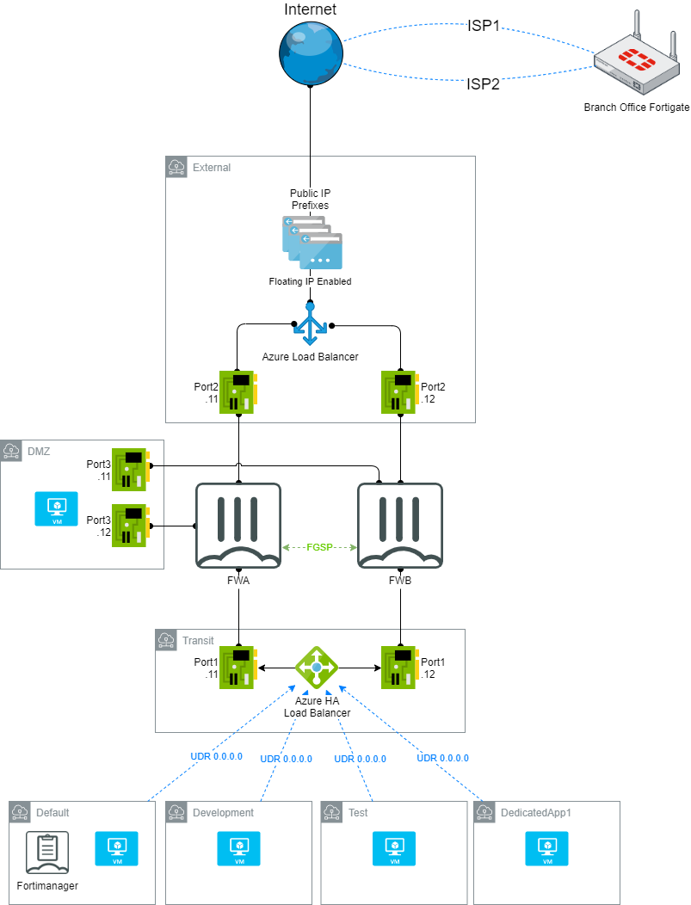

# Fortigate Azure Load-Balancing HA Bicep Template

This is a reimplementation of the [Fortigate Azure Load-Balancing HA](https://github.com/fortinetsolutions/Azure-Templates/tree/master/FortiGate/Azure%20Active-Active%20LoadBalancer%20HA-Ports) ARM template in bicep format, with significant improvements and cleanup.

This is optimized for performing UDR from subnets and other vnets to the "transit" port to provide a central hub in a cost effective way (without using Virtual WAN)



## Modules
1. main: the controller module that you should compile
2. network: provisions a vnet and related subnets if you do not supply your own
3. loadbalancer: provisions the internal and external "sandwich" load balancers for the fortigate
4. fortigate: provisions the two fortigate VM instances

## New Features
1. Simplified license, image, and size selection
1. Loads of intelligent defaults, only mandatory parameter is the admin password for security
1. [Azure Serial Console](https://docs.microsoft.com/en-us/troubleshoot/azure/virtual-machines/serial-console-overview) Support
1. Specify an Azure SSH Key resource for fortigate login
1. Spot instance support for devtest or low-cost deployments
1. [CloudInit](https://docs.fortinet.com/document/fortigate/6.2.0/aws-cookbook/760385/cloud-init) initial setup of common features and ability to specify custom initial startup configuration
1. Automated Fortimanager Connection Process
1. Automatically generated SSH config and URI to quickly access your deployed fortigate

## Notes
1. `admin` is deliberately configured as a fortimanager-only user and cannot be logged into remotely

## Fortimanager Low Touch Configuration
This template supports automatic connection to a Fortimanager instance and enables authorization with a single command (due to a limitation in Fortimanager)
1. Specify the FortimanagerFqdn and (optionally) the Fortimanager Password to use. If you do not specify a password it will generate one automatically
1. Upon deployment you should see the fortigates connected to the relevant fortimanager
1. Connect to the fortimanager and run the commands specified by the `fgaFortimanagerSharedKeyCommand` and `fgbFortimanagerSharedKeyCommand`
1. Click `Authorize` and fortimanager should now connect and be able to manage the nodes.
A*TODO: Automate this process with a Powershell Deployment Script Maybe?*

## Using as a module
You can use this entire repository as a module in another bicep. This functionality is forthcoming in bicep but for now you can use `git submodules`
```
git submodule add https://github.com/justingrote/fortigateazureha
```
And in your bicep config
```
module fortigateAzureHA 'fortigateazureha/main.bicep' = {
  name: '${deployment().name}-FortigateAzureHA'
  params:{
    AdminPassword: 'changeMeToSomethingS3cure'
  }
}
```
See https://github.com/justingrote/fortigateazurehaexampleusage for an example

## Azure Powershell Deployment Examples

**NOTE:** Az.Resources 3.3.0 has a bug where it does not compile multi-file bicep correctly, hence the intermediate build step

All examples include `-WhatIf` so you can see what would be deployed, remove to do it for real.

### Simple Deployment (Splatting Syntax)
```powershell
bicep build main.bicep
$FortigateDeploymentParams = @{
    TemplateFile = 'main.json'
    ResourceGroupName = 'my-rg'
    Location = 'westus'
    Name = 'MyFortigateDeployment'
    #Default AdminUsername is 'fgadmin', specify AdminUsername to customize it
    AdminPassword = 'changeme' | ConvertTo-SecureString -AsPlainText -Force
}
New-AzResourceGroupDeployment @FortigateDeploymentParams -WhatIf
```
### Simple Deployment (Parameter Syntax)
```powershell
bicep build main.bicep
New-AzResourceGroupDeployment -TemplateFile main.json -ResourceGroupName 'my-rg' -Location 'westus' -Name 'MyFortigateDeployment' -AdminPassword $('changeme' | ConvertTo-SecureString -AsPlainText -Force) -WhatIf
```

### Connect to an Existing Fortimanager
```powershell
bicep build main.bicep
$FortigateDeploymentParams = @{
    TemplateFile = 'main.json'
    ResourceGroupName = 'my-rg'
    Location = 'westus'
    Name = 'MyFortigateDeployment'
    AdminPassword = 'changeme' | ConvertTo-SecureString -AsPlainText -Force
    FortiManagerFQDN = 'myfortimanager.mycompany.com'
    FortiManagerPassword = 'changemefortimanager' #Admin user is set to this password and is disallowed remote login. Fortimanager will use this to connect
}
New-AzResourceGroupDeployment @FortigateDeploymentParams -WhatIf
```
The fortigates will register with the Fortimanager, but you will need to run the commands specified in the `FortimanagerSharedKeyCommand` output on the fortigate prior to clicking Authorize.


### Use Spot instances, BYOL licensing, and specify a different instance size to save cost
```powershell
bicep build main.bicep
$FortigateDeploymentParams = @{
    TemplateFile = 'main.json'
    ResourceGroupName = 'my-rg'
    Location = 'westus'
    Name = 'MyFortigateDeployment'
    AdminPassword = 'changeme' | ConvertTo-SecureString -AsPlainText -Force
    UseSpotInstances = $true
    BringYourOwnLicense = $true
    VMSize = 'Standard_F2s_v2' #Must have at least two nics
}
New-AzResourceGroupDeployment @FortigateDeploymentParams -WhatIf
```

### Integrate with existing vNet
```powershell
bicep build main.bicep
$FortigateDeploymentParams = @{
    TemplateFile = 'main.json'
    ResourceGroupName = 'my-rg'
    Location = 'westus'
    Name = 'MyFortigateDeployment'
    AdminPassword = 'changeme' | ConvertTo-SecureString -AsPlainText -Force
    VNetId = '/subscriptions/my-subcription-guid/myvnetname' #Fetch from vnet properties in Azure Portal
    ExternalSubnetName = 'MyCustomExternalSubnetName'
    InternalSubnetName = 'MyCustomTransitSubnetName'
}
New-AzResourceGroupDeployment @FortigateDeploymentParams -WhatIf
```
You will need to attach the generated route table to any subnets that you want to be forced via the fortigate's transit network.


---
**NOTE:** There are many other ways to specify deployment parameters than are covered here, such as the `-ParameterFile` option and the `-ParameterObject` option.